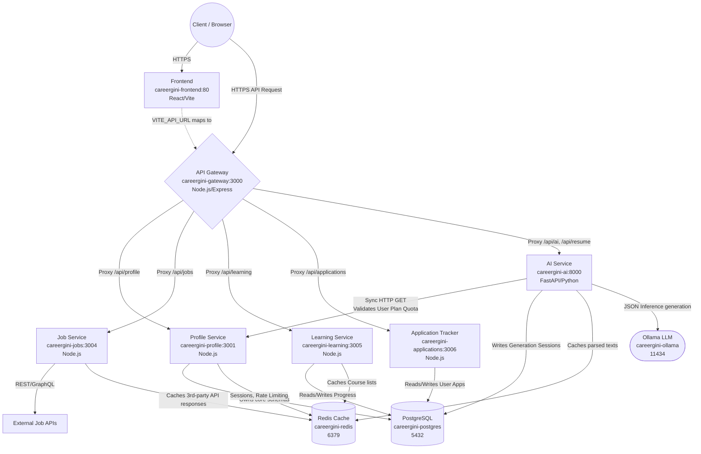

# CareerGini Master Developer Onboarding & Support Guide

Welcome to the CareerGini platform. This master reference guide is designed for **Frontend (FE) and Backend (BE) developers** for onboarding, feature development, and active production support. It provides an exhaustive breakdown of the architecture, connection layers, state management, and troubleshooting playbooks.

---

## 🏗️ 1. Global Architecture & Data Flow

CareerGini is a multi-container, domain-driven microservices architecture communicating via a centralized API Gateway, all running within an isolated Docker bridge network (`careergini-network`).

### 1.1 Topography Diagram



### 1.2 Inter-Service Dependency Rules
*   **The Gateway Rule**: The Frontend **never** communicates directly with a microservice or database. It only calls `/api/*` endpoints on the API Gateway.
*   **The Profile Dependency Rule**: The AI Service (`careergini-ai`) acts as a consumer of the Profile Service. Before executing any heavy LLM operation, it calls `http://careergini-profile:3001/internal/user-plan/:user_id` to strictly verify the user's tier and remaining AI credits.
*   **Database Schema Ownership**: The `careergini-profile` service is the definitive owner of the PostgreSQL schema. Migrations and initializations happen via `profile-service/schema_enhancements.sql`. Other services connect to the same DB but manage isolated tables (e.g., `application-service` manages `user_applications`).

---

## 🎨 2. Frontend Developer Deep Dive (`careergini-frontend`)

**Stack:** React, TypeScript, Vite, Tailwind CSS (assumed), Axios.

### 2.1 State Management & Protection
*   **Auth State (`AuthContext.tsx`)**: The source of truth for user logged-in state.
    *   **Flow**: On successful OAuth via the Gateway, the Gateway sets an HTTP-Only cookie OR returns a JWT token. `AuthContext` decodes this token, stores the user ID and Plan Tier in memory, and triggers re-renders.
    *   **Protection**: Routes are wrapped in `<ProtectedRoute>` (demands JWT valid) and `<PlanProtectedRoute>` (demands specific Plan Tier).
*   **Resume Builder State (`ResumeBuilderPage.tsx`)**: This is the most complex UI component. It operates as a multi-stage wizard.
    *   **Defensive Parsing**: AI responses are inherently volatile. When the AI returns tailored content, the frontend MUST employ defensive chaining to avoid crashes:
        `const gapAnalysis = data.tailored_content.gap_analysis || persona?.gap_analysis || [];`
    *   **File Uploads**: Uses `FormData` objects. The API Gateway explicitly ignores body parsing for `/api/resume/upload` to ensure the multipart boundary remains intact as it proxies to Python.

### 2.2 Frontend Troubleshooting
*   **Issue: CORS Errors in Console**
    *   **Fix**: Ensure `VITE_API_URL` exactly matches the origin making the request. If the app is on `https://careergini.com`, `VITE_API_URL` must be just the base URL, and the Gateway handles the `/api` routing.
*   **Issue: Infinite Loading Spinner after OAuth Login**
    *   **Fix**: The JWT token was not successfully extracted from the callback URL or HTTP-Only cookie. Check the browser's App/Storage tab and `AuthContext` parsing logic.

---

## 🚦 3. API Gateway Deep Dive (`haystack-api-gateway`)

**Stack:** Node.js, Express, `express-http-proxy`.

### 3.1 Proxy Routing Configurations
The file `index.js` defines the topographical map of the entire backend block.
*   `app.use('/api/ai', proxy('http://haystack-service:8002', ...))`
*   `app.use('/api/profile', proxy('http://careergini-profile:3001'))`
*   `app.use('/api/jobs', proxy('http://job-service:3002'))`
*   `app.use('/api/learning', proxy('http://learning-service:3003'))`
*   `app.use('/api/applications', proxy('http://application-service:8006'))`

### 3.2 Gateway Troubleshooting
*   **Issue: Node.js 120s Timeout Kills AI Generation**
    *   **Fix**: LLM generation takes time. The Gateway is explicitly configured to override standard Node.js timeouts via:
        `server.timeout = 1200000; server.keepAliveTimeout = 1200000;`
        If you see `504 Gateway Timeout` instantly after 2 minutes, check that these settings are active and Nginx upstream timeouts match.
*   **Issue: File Uploads Fail (Corrupted data)**
    *   **Fix**: Ensure `parseReqBody: false` is set on the proxy configuration for `/api/ai` and `/api/resume`. If Express parses the multipart form before proxying, the Python FastAPI backend will reject the mutated boundary payload.

---

## 🧠 4. AI & Resume Generation Core (`haystack-service`)

**Stack:** Python, FastAPI, Haystack Framework, Jinja2, LaTeX (xelatex). This is the analytical heart of CareerGini.

### 4.1 Flow of the `/resume/tailor` Endpoint (The Core Algorithm)
This is the most critical pipeline in the application (`main.py` -> `ResumeAdvisorAgent.tailor_resume()`).
1.  **Ingestion:** Accepts the user's `persona` (JSON) and a textual `job_description`.
2.  **Quota Verification:** Makes an internal HTTP GET to the Profile Service checking `plan_tier` limits.
3.  **LLM Prompting (Ollama):** A strict JSON-schema prompt is sent to `qwen2.5:1.5b`. It asks the LLM to rewrite the user's experience highlighting overlaps with the JD.
4.  **Gap Analysis Fallback:** If the LLM output is malformed, `_compute_gap_analysis` runs deterministic keyword extraction (Python `set` comparisons) against the JD to guarantee the user receives actionable missing-skill feedback.
5.  **ATS Scoring:** `resume_ats_scorer.py` evaluates the newly tailored text.
6.  **Return Data:** FastAPI returns the fully merged and tailored dictionary to the frontend.

### 4.2 Document Generation Flow (`/resume/generate`)
1.  **Template Binding**: The tailored JSON is passed to `latex_generator.py`.
2.  **Jinja2 Templating**: `latex_templates/*.tex.j2` receives the data. Note: The environment uses custom limiters (`\\BLOCK{`, `\\VAR{`) instead of standard `{%` and `{{` to prevent collisions with native LaTeX syntax.
3.  **Compilation**: `xelatex` is called via `subprocess.run()`. It is run **twice** to ensure layout margins and references compile perfectly.
4.  **Fallback**: `docx_generator.py` mirrors the structure for editable Word outputs.

### 4.3 AI Backend Troubleshooting
*   **Issue: Database errors / Cannot find session**
    *   **Fix**: Ensure local Docker volumes aren't clashing.
*   **Issue: `ImportError: attempted relative import with no known parent package`**
    *   **Fix**: Do not use `from . import X` in scripts intended to run as main modules. Always use absolute imports.
*   **Issue: LaTeX PDF completely broken or missing fonts**
    *   **Fix**: Verify `texlive-xetex` and `texlive-fonts-extra` installed successfully in the Docker image. Examine the logs of the `subprocess` command in `latex_generator.py` for LaTeX-specific compilation halts (`Use of \@xstrut doesn't match its definition`).

---

## 👤 5. Profile Service Deep Dive (`profile-service`)

**Stack:** Node.js, Express, `pg` (PostgreSQL client).

### 5.1 Auth and Data Management
*   **Endpoints**: Handled in `index.js`.
    *   `/auth/*`: The OAuth wrappers.
    *   `/profile`: Main CRUD operations for user identity.
*   **Access Control**: Uses JWT middleware (`verifyToken`) and Admin middleware (`verifyAdmin`).
*   **Database Admin**: All primary user tables (`users`, `user_plans`, `activity_logs`) are governed here.

### 5.2 Usage Quotas
*   **Endpoint**: `/internal/user-plan/:user_id`
*   **Logic**: The DB schema enforces columns for `plan_tier` (free, pro, premium) and `credits`. Each call to the AI service reduces credits. Free tiers are rate-limited heavily.

### 5.3 Profile Service Troubleshooting
*   **Issue: Admin route throws 403 Forbidden**
    *   **Fix**: Ensure `role='admin'` is set on the user's row in PostgreSQL.
*   **Issue: Payments Webhook Fails**
    *   **Fix**: Ensure the external Gateway IPs (Stripe/PayPal) are permitted through your firewall and the secret keys (`STRIPE_SECRET`, etc.) are valid in `.env`.

---

## 🏢 6. Domain Services Deep Dive (Jobs, Learning, Applications)

### 6.1 Job Service (`job-service:3004`)
*   **Purpose**: Sits between CareerGini and RapidAPI/LinkedIn.
*   **Caching Strategy**: Heavily relies on Redis (`DB 2`). Requests for general queries (e.g., "Software Engineer Remote") are cached for 12 hours.
*   **Debugging**: If "No Jobs" is returned, check Redis connectivity and RapidAPI limits.

### 6.2 Application Tracker Service (`application-service:3006`)
*   **Purpose**: Manages the Kanban board data structure.
*   **Data Structure**: Stores applications with `status` strings (`not_applied`, `interviewing`, `rejected`).
*   **Analytics**: Averages days-to-hire and rejection rates via SQL aggregate functions in `/analytics/funnel`.

### 6.3 Learning Service (`learning-service:3005`)
*   **Purpose**: Suggests courses based on the outputs of the AI Service's `Gap Analysis`.

---

## 🚨 7. Production Playbook: Disaster Resolution

When the platform triggers critical PagerDuty alerts, follow this immediate triage protocol:

### Level 1: "The Website is Down" (Frontend/Gateway)
1.  **Check Nginx**: `systemctl status nginx` (If running behind a reverse proxy).
2.  **Check Gateway**: `docker logs careergini-gateway --tail 50`.
    *   Are you seeing `ECONNREFUSED`? Proceed to Level 2.
    *   Are you seeing HTTP 500s? The Gateway code threw an exception.

### Level 2: "A Specific Feature is Broken" (Microservices)
1.  **Identify Endpoint**: Hit F12 in browser. Find the failing Network request (e.g., `/api/profile/me` failed).
2.  **Map to Service**: Using the Gateway map, `/api/profile` means `careergini-profile`.
3.  **Inspect Logs**: `docker logs careergini-profile --tail 100`.
4.  **Database check**: Does the log show `password authentication failed` or `database "careergini" does not exist`? Check Postgres.

### Level 3: "AI Tailoring Stalls or Errors" (Ollama / AI Service)
1.  **Verify Ollama is Alive**: `docker logs careergini-ollama`. Make sure the container hasn't run Out Of Memory (OOMKilled).
2.  **Verify Model Exists**: `docker exec -it careergini-ollama ollama list`. You MUST see `qwen2.5:1.5b`. If not, run `docker exec -it careergini-ollama ollama pull qwen2.5:1.5b`.
3.  **Check Python Traces**: `docker logs careergini-ai`. Look for `pydantic.ValidationError` which indicates the Ollama response shape fundamentally shifted and broke the parser.

### Core Re-deployment Command
If a hotfix is applied locally via `git pull`, rebuild gracefully without taking down unrelated services:
```bash
# Example: Hotfixing the AI Service without interrupting Frontend
docker compose build ai-service && docker compose up -d --no-deps ai-service
```
